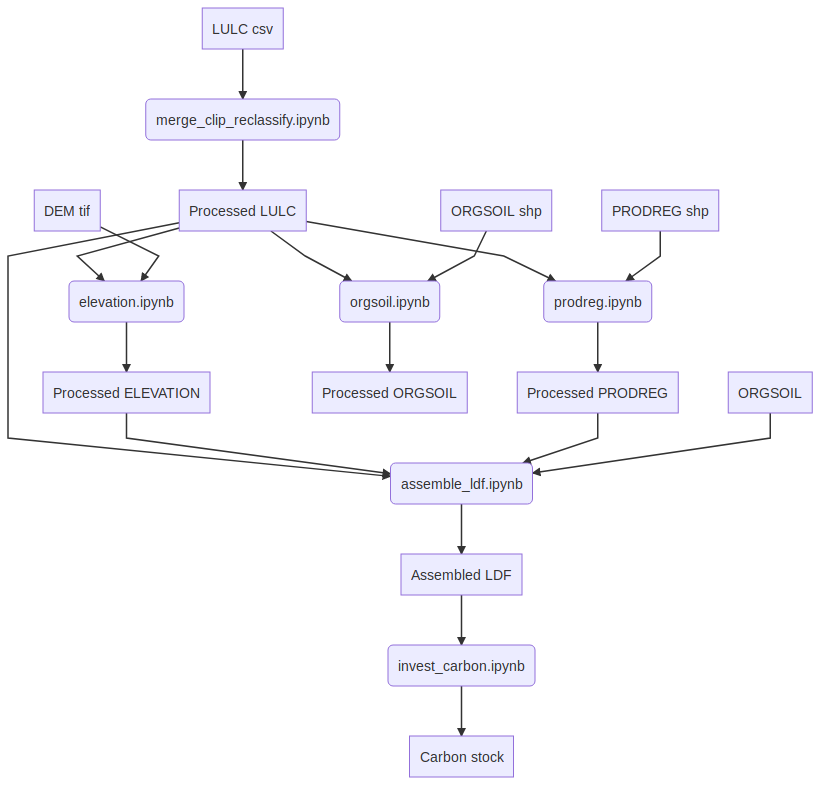

# Evaluation of the carbon sequestration for the canton of Vaud

**Citation**: Jaligot, R., Chenal, J. & Bosch, M. "Assessing spatial temporal patterns of ecosystem services in Switzerland". *Landscape Ecol* (2019): 1-16. https://doi.org/10.1007/s10980-019-00850-7

## Analysis DAG

Given how the Swiss Land Statistics datasets are provided (see [this for more info](https://github.com/martibosch/swisslandstats-geopy)), we work with "LandDataFrames", i.e., tables where each row correspond to an (x, y) geo-referenced pixel, and columns provide categorical information, such as the land use/land cover, elevation, production regions and organic soil. This information is used to compute the carbon stock with the InVEST's carbon model.

The results are displayed in [invest_carbon.ipynb](https://github.com/martibosch/carbon-sequestration-vaud/blob/master/invest_carbon.ipynb)

## Instructions to reproduce the repository

### Preparing the environment

1. Create the conda environment

        # the environment's name will be `carbonseq_vaud`
        conda env create -f environment.yml

2. Configure your S3 profile (credentials, region and endpoint URL)

3. Enter the fresh environment

        conda activate carbonseq_vaud

4. Already within the environment, make it available as a `jupyter` kernel as in:

        python -m ipykernel install --user --name carbonseq_vaud --display-name "Python (carbonseq_vaud)"

### Reproducing

1. From the repository's root, create a folder named `papermill_outputs`

2. Pull the data from the dvc remote

        dvc pull
        
3. Reproduce the land data frame

        dvc repro data/vaud_ldf.csv.dvc
        
Now you can execute the Notebook `invest.ipynb`
