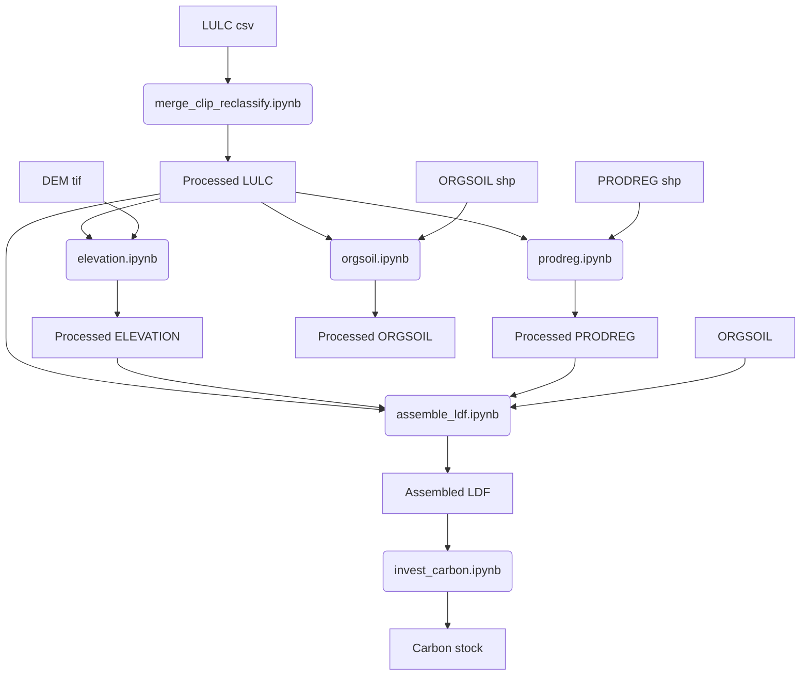

```mermaid
graph TD
LULC[LULC csv] --> MAR(merge_clip_reclassify.ipynb);
MAR --> LULCO[Processed LULC];

LULCO --> ELEVATIONP(elevation.ipynb);
ELEVATIONI[DEM tif] --> ELEVATIONP;
ELEVATIONP --> ELEVATIONO[Processed ELEVATION];

LULCO --> PRODREGP(prodreg.ipynb);
PRODREGI[PRODREG shp] --> PRODREGP;
PRODREGP --> PRODREGO[Processed PRODREG];

LULCO --> ORGSOILP(orgsoil.ipynb);
ORGSOILI[ORGSOIL shp] --> ORGSOILP;
ORGSOILP --> ORGSOILO[Processed ORGSOIL];

LULCO --> ASSEMBLEP(assemble_ldf.ipynb);
ELEVATIONO --> ASSEMBLEP;
PRODREGO --> ASSEMBLEP;
ORGSOIL --> ASSEMBLEP;
ASSEMBLEP --> ASSEMBLEO[Assembled LDF];

ASSEMBLEO --> INVEST(invest_carbon.ipynb);
INVEST --> CARBON[Carbon stock];
```
